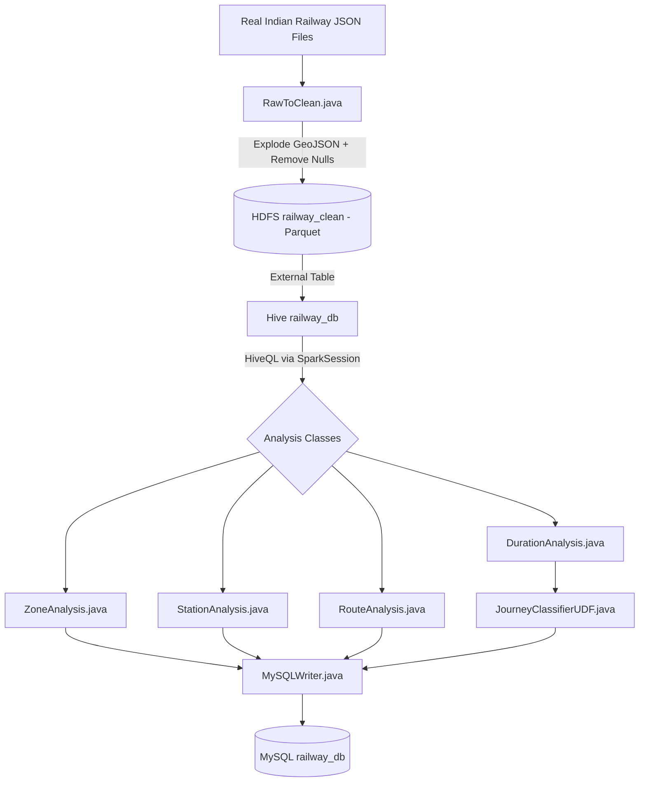
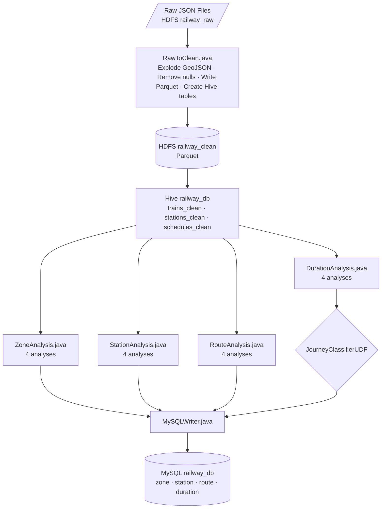

# 🚂 RailwayDelayIntelligence — Indian Railway Big Data Analytics System

A Big Data pipeline that analyzes real Indian Railway data using Java, Spark, HDFS, Hive, and MySQL.
Processes **5,208 trains**, **8,990 stations**, and **3,89,245 schedules** to extract zone, station, route, and duration insights.

---

## 🏗️ Architecture



---

## 🛠️ Tech Stack

| Technology       | Version     | Purpose                                         |
|------------------|-------------|-------------------------------------------------|
| Java             | 1.8.0_482   | Ingestion, analysis, UDF, MySQL writing         |
| Apache Spark     | 3.2.4       | Distributed data processing                     |
| Scala            | 2.12.15     | Spark runtime compatibility                     |
| HDFS             | 2.10.2      | Distributed storage for raw and clean data      |
| Apache Hive      | 3.1.3       | SQL-based analytics via HiveQL                  |
| MySQL            | 8.x         | Final output storage for all analysis results   |
| Maven            | 3.x         | Dependency management and build                 |

---

## 📊 Key Findings

| Analysis           | Finding                                             |
|--------------------|-----------------------------------------------------|
| Zone Analysis      | NR zone has the most trains — **628 trains**        |
| Busiest Station    | Itarsi Junction — **284 trains**                    |
| Longest Route      | Vivek Express — **4,279 km / 85 hrs**               |
| Most Stations      | Uttar Pradesh — **529 stations**                    |
| Longest Avg Route  | ECoR zone — **978 km average**                      |
| ULTRA Journeys     | **1,584 trains** with journey > 720 minutes         |

---

## 🗂️ Journey Classification (UDF)

| Category    | Duration           |
|-------------|--------------------|
| SHORT       | ≤ 60 minutes       |
| MEDIUM      | 61 – 180 minutes   |
| LONG        | 181 – 360 minutes  |
| EXTRA LONG  | 361 – 720 minutes  |
| ULTRA       | > 720 minutes      |

---

## 📁 Project Structure

```
RailwayDelayIntelligence/
├── src/main/java/com/railway/
│   ├── ingestion/
│   │   └── RawToClean.java            # GeoJSON → Parquet cleaner
│   ├── analysis/
│   │   ├── ZoneAnalysis.java          # 4 zone-level analyses
│   │   ├── StationAnalysis.java       # 4 station-level analyses
│   │   ├── RouteAnalysis.java         # 4 route-level analyses
│   │   └── DurationAnalysis.java      # 4 duration analyses + UDF
│   ├── udf/
│   │   └── JourneyClassifierUDF.java  # SHORT / MEDIUM / LONG / EXTRA LONG / ULTRA
│   ├── output/
│   │   └── MySQLWriter.java           # Writes all results to railway_db
│   └── main/
│       └── RailwayMain.java           # Entry point — runs full pipeline
├── src/main/resources/
│   └── hive-site.xml
└── pom.xml
```

---

## 🗄️ HDFS Structure

```
/railway_prj/
├── railway_raw/
│   ├── trains/trains.json         # 5,208 trains (GeoJSON)
│   ├── stations/stations.json     # 8,990 stations (GeoJSON)
│   └── schedules/schedules.json   # 4,17,080 raw records
├── railway_clean/
│   ├── trains/                    # Parquet — cleaned trains
│   ├── stations/                  # Parquet — cleaned stations
│   └── schedules/                 # Parquet — 3,89,245 records
└── railway_insights/
    ├── zone_analysis/
    ├── busiest_stations/
    ├── longest_routes/
    └── duration_analysis/
```

---

## 🗃️ Hive & MySQL Tables

**Hive Tables — `railway_db`**

| Table            | Description              |
|------------------|--------------------------|
| trains_clean     | Cleaned trains data      |
| stations_clean   | Cleaned stations data    |
| schedules_clean  | Cleaned schedules data   |

**MySQL Tables — `railway_db`**

| Table             | Description                        |
|-------------------|------------------------------------|
| zone_analysis     | Train count & avg duration by zone |
| station_analysis  | Busiest stations, state-wise count |
| route_analysis    | Longest & shortest routes          |
| duration_analysis | Journey category breakdown         |

---

## ⚙️ Pipeline Flow



---

## 📦 Maven Dependencies

| Artifact                 | Version |
|--------------------------|---------|
| spark-core_2.12          | 3.2.4   |
| spark-sql_2.12           | 3.2.4   |
| spark-hive_2.12          | 3.2.1   |
| hadoop-client            | 2.10.2  |
| mysql-connector-java     | 8.0.33  |

---

## 🚀 How to Run

```bash
# 1. Ensure HDFS, Hive Metastore, and MySQL are running

# 2. Upload raw JSON files to HDFS
hdfs dfs -put trains.json    /railway_prj/railway_raw/trains/
hdfs dfs -put stations.json  /railway_prj/railway_raw/stations/
hdfs dfs -put schedules.json /railway_prj/railway_raw/schedules/

# 3. Build the project
mvn clean package -DskipTests

# 4. Run the full pipeline
spark-submit \
  --class com.railway.main.RailwayMain \
  --master local[*] \
  target/RailwayDelayIntelligence-1.0.jar
```

---

## 📋 Environment

| Component       | Value                        |
|-----------------|------------------------------|
| OS              | Ubuntu 24                    |
| Java            | 1.8.0_482                    |
| Spark           | 3.2.4                        |
| Scala           | 2.12.15                      |
| Hive            | 3.1.3                        |
| Hadoop          | 2.10.2                       |
| HDFS Port       | 50000                        |
| Hive Metastore  | metastore_db (Derby)         |
| Project DB      | railway_db (MySQL)           |

---

## 📌 Data Source

- **trains.json** — 5,208 real Indian trains in GeoJSON format
- **stations.json** — 8,990 real Indian stations in GeoJSON format
- **schedules.json** — 4,17,080 raw schedule records (simple JSON array)

All files represent real Indian Railway network data.

---

## About

Big Data analytics pipeline for Indian Railway using Java, Spark, HDFS, Hive & MySQL.
Processes 5,208 trains, 8,990 stations, and 3,89,245 schedules — extracting zone, station, route, and duration insights.
